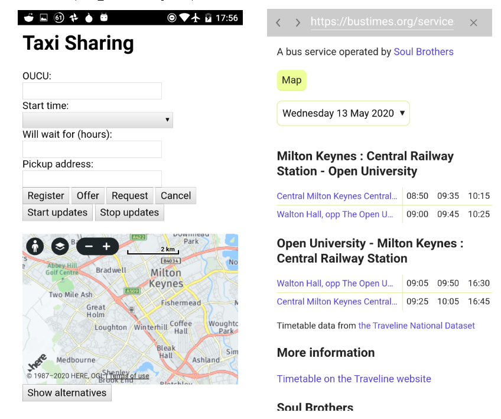
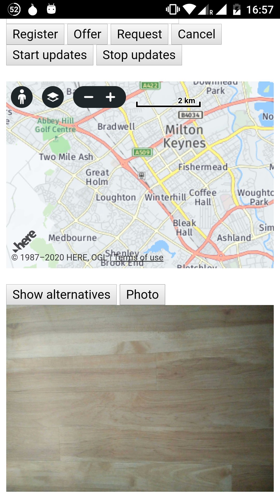

# Taxi Sharing

This is a mobile taxi sharing app that lets users register, offer, request and cancel taxi-sharing. It shows matching taxi locations on the map.
Furthermore, it allows users to check the bus schedules and take a picture of their taxi.

## Getting Started

### Create Cordova project

```bash
cordova create my-taxi-sharing-app
```

Replace index.html and index.js files in www/ with the index.html and index.js files from this repository.

Add Android and browser support:

```bash
cordova platform add android
cordova platform add browser
```

### Add plugins

Camera:

```bash
cordova plugin add cordova-plugin-camera@3.0.0
```

In-app-browser:

```bash
cordova plugin add cordova-plugin-inappbrowser
```

### Build and run

Build:

```bash
cordova build android
```

Run:

```bash
cordova run android
cordova run browser
```

## Demo
#### Home and Show alternatives

#### Take photo 



## Other

To stop updates every 10 seconds, comment out the following line in index.js:

```javascript
timertimerId = setInterval(updateMatchingStatus, 10000)
```

In index.js, add your own app_id and app_code:

```javascript
app_id: "", // TODO: Change to your own APP_ID (HERE Map)
app_code: "", // TODO: Change to your own APP_CODE (HERE Map)
```

## Technologies

HTML5 \
CSS3 \
JavaScript \
jQuery \
Apache Cordova

For persistance and storage a provided REST API is used.
OpenStreetMap and HERE APIs are used for displaying the map and the markers.


